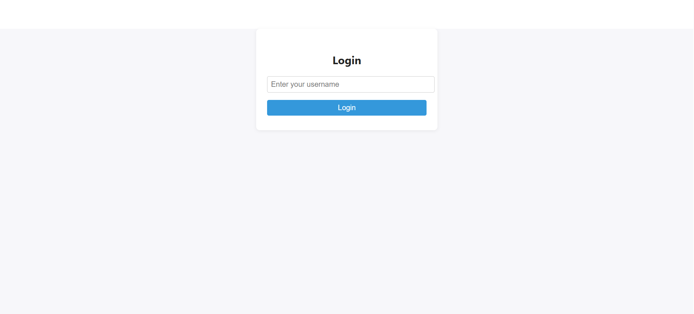
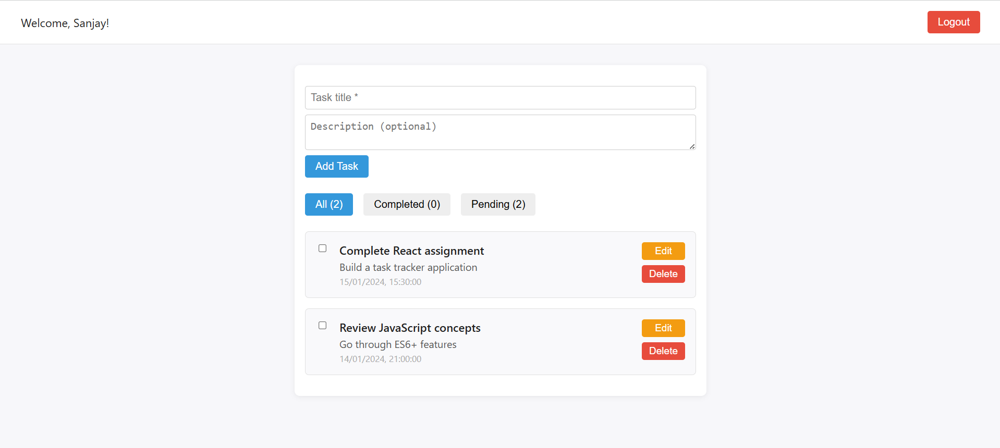

# Personal Task Tracker

## 📖 Description
A simple, responsive personal task management application built with React. Easily add, edit, complete, and filter your tasks. Designed for clean code, clear structure, and a great user experience.

## 🚀 Features
- Simple login (username only, stored in localStorage)
- Add tasks (title required, description optional)
- Edit tasks inline
- Delete tasks with confirmation
- Toggle tasks as completed or pending
- View task title, description, status, and creation date/time
- Visual distinction between completed and pending tasks
- Filter tasks by All, Completed, or Pending
- Task count for each filter
- Data persistence with localStorage (tasks persist after refresh)
- Responsive design for mobile and desktop
- Sample tasks always present for testing/demo

## 🛠 Setup Instructions
1. **Clone the repository:**
   ```bash
   git clone [repository_url]
   cd task-tracker
   ```
2. **Install dependencies:**
   ```bash
   npm install
   ```
3. **Start the development server:**
   ```bash
   npm start
   ```
4. **Open in your browser:**
   [http://localhost:3000](http://localhost:3000)

## 🧰 Technologies Used
- React.js
- CSS (custom, responsive)

## 🔗 Live Demo
task-tracker-fawn-phi.vercel.app

## 🖼 Screenshots
| Login Page | Dashboard |
|------------|-----------|
|  |  |

> _Add screenshots to a `screenshots/` folder in your repo, or update the paths above._

## 📦 Project Structure
```
task-tracker/
├── public/
│   └── index.html
├── src/
│   ├── components/
│   │   ├── Login.js
│   │   ├── TaskForm.js
│   │   ├── TaskItem.js
│   │   ├── TaskList.js
│   │   └── TaskFilter.js
│   ├── utils/
│   │   └── localStorage.js
│   ├── styles/
│   │   └── App.css
│   ├── App.js
│   └── index.js
├── README.md
└── package.json
```

## 🧪 Sample Data for Testing
```js
const sampleTasks = [
  {
    id: 1,
    title: "Complete React assignment",
    description: "Build a task tracker application",
    completed: false,
    createdAt: "2024-01-15T10:00:00Z"
  },
  {
    id: 2,
    title: "Review JavaScript concepts",
    description: "Go through ES6+ features",
    completed: true,
    createdAt: "2024-01-14T15:30:00Z"
  }
];
```

## ✨ Bonus Ideas (Not Implemented)
- Search functionality
- Task priority levels
- Due dates for tasks
- Smooth animations/transitions
- Dark mode toggle
- Task categories/tags

## 📝 License
MIT
